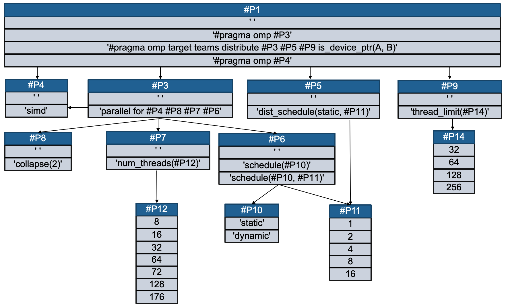

Tutorial: Autotune the OpenMP version of convolution-2d 
===================

This tutorial describes how to define autotuning problem and an evaluating method for autotuning PolyBench convolution-2d. 

We assume that you have checked out a copy of `ytopt`. For guidelines on how to get ytopt set up, refer [Install instructions](https://github.com/ytopt-team/ytopt/blob/tutorial/README.md). 

This example requies cuda and gpu. We implemnet this example with the following settings:
- cuda: 
```
nvcc: NVIDIA (R) Cuda compiler driver
Copyright (c) 2005-2021 NVIDIA Corporation
Built on Wed_Jun__2_19:15:15_PDT_2021
Cuda compilation tools, release 11.4, V11.4.48
Build cuda_11.4.r11.4/compiler.30033411_0
```
- gpu machine:
```
Quadro RTX 8000
```

Indentifying a problem to autotune 
-----------------------
In this tutorial, we target to autotune PolyBench convolution-2d kernel `<https://github.com/cavazos-lab/PolyBench-ACC/tree/master/OpenMP>`.

PolyBench convolution-2d kernel is one of the famous exmples of stencil computation [(reference)](https://github.com/cavazos-lab/PolyBench-ACC/tree/master/OpenMP). Save the related source and header files in the seprate folder: `convolution-2d.c`, `convolution-2d.h`, `polybench.c`, `polybench.h`, `polybench.h-cuda`. 

We omit presenting the files for space. For your convenience, we have the files in `<https://github.com/ytopt-team/ytopt/tree/tutorial/ytopt/benchmark/convolution-2d>`. 

<!--
In this exmaple, we introduce a constraint on parameters for openmp schedule types and block sizes. In the `mmp_cons.c`, we replace markers for the related paramters from the source file of the unconstrained problem `mmp.c` as follows (`mmp.c`⮕`mmp_cons.c`): 
`#pragma omp parallel for schedule(dynamic,#P1) reduction(+:verification)` ⮕ `#pragma omp parallel for schedule(#P1) reduction(+:verification)`
`#pragma omp parallel for schedule(dynamic, #P1)` ⮕ `#pragma omp parallel for schedule(#P1)`
 -->

Defining autotuning problem
-----------------------
We describe how to define your search problem `<https://github.com/ytopt-team/ytopt/blob/tutorial/ytopt/benchmark/convolution-2d/convolution-2d/problem.py>`

--------------
First, we first define search space using ConfigSpace that is a python library `<https://automl.github.io/ConfigSpace/master/>`.


```python
# import required library
import os, sys, time, json, math
import numpy as np
from autotune import TuningProblem
from autotune.space import *
import ConfigSpace as CS
import ConfigSpace.hyperparameters as CSH
from skopt.space import Real, Integer, Categorical
```

Our search space with constraints can be visualized such as:



Each parameter is defined as:


```python
# create an object of ConfigSpace 
cs = CS.ConfigurationSpace(seed=1234)
p1 = CSH.CategoricalHyperparameter(name='p1', choices=[' ','#pragma omp #P3','#pragma omp target teams distribute #P3 #P5 #P9 is_device_ptr(A, B)','#pragma omp #P4'], default_value=' ')
p3 = CSH.CategoricalHyperparameter(name='p3', choices=[' ','parallel for #P4 #P8 #P6 #P7'])
p4 = CSH.CategoricalHyperparameter(name='p4', choices=[' ', 'simd'])
p5 = CSH.CategoricalHyperparameter(choices=[' ', 'dist_schedule(static, #P11)'],name='p5') #make a different second param 64 - 512
p6 = CSH.CategoricalHyperparameter(choices=[' ', 'schedule(#P10, #P11)', 'schedule(#P10)'],name='p6')
p7 = CSH.CategoricalHyperparameter(choices=[' ', 'num_threads(#P12)'],name='p7')
p8 = CSH.CategoricalHyperparameter(choices=[' ', 'collapse(2)'],name='p8')
p9 = CSH.CategoricalHyperparameter(choices=[' ', 'thread_limit(#P14)'],name='p9')
p10 = CSH.CategoricalHyperparameter(choices=['static','dynamic'], name='p10')
p11 = CSH.OrdinalHyperparameter(sequence=['1', '2', '4', '8', '16'], name = 'p11') #n(size of data)/num thrads. maybe 2 and 4?
p12 = CSH.OrdinalHyperparameter(sequence=['8',  '16', '32', '64', '72', '128', '176'], name='p12') #need to make it higher, maybe get rid of the low ones
p14 = CSH.OrdinalHyperparameter(sequence=['32', '64', '128', '256'], name='p14')
#p1 always there, so add it, then check if p2 exists
cs.add_hyperparameters([p1,p3,p4,p5,p6,p7,p8,p9,p10,p11,p12,p14])
```

<!--
Then, we define a constraint to decide block size for static and dynamic schedule. 


`p1` specifies omp scheduling types. If either `dynamic` or `static` is chosen, we do not specify block-size so that OpenMP divides loop iterations approximately equal in size for `static` and selects a default size one for `dynamic`. If either `dynamic,#P3` or `static,#P3` is chosen, we need another parameter `p3` to specify a block-size for static/dynamic schedule. This can be visualized such as:

-->

We can add the constraints such as follows:


```python
# add condition
cond0 = CS.InCondition(p3, p1, ['#pragma omp #P3','#pragma omp target teams distribute #P3 #P5 #P9 is_device_ptr(A, B)'])
cond1 = CS.EqualsCondition(p5, p1, '#pragma omp target teams distribute #P3 #P5 #P9 is_device_ptr(A, B)')
cond2 = CS.EqualsCondition(p9, p1, '#pragma omp target teams distribute #P3 #P5 #P9 is_device_ptr(A, B)')
cond3 = CS.OrConjunction(CS.EqualsCondition(p4, p1, '#pragma omp #P4'),
                         CS.EqualsCondition(p4, p3, 'parallel for #P4 #P8 #P6 #P7'))
cond4 = CS.EqualsCondition(p6, p3, 'parallel for #P4 #P8 #P6 #P7')
cond5 = CS.EqualsCondition(p7, p3, 'parallel for #P4 #P8 #P6 #P7')
cond6 = CS.EqualsCondition(p8, p3, 'parallel for #P4 #P8 #P6 #P7')
cond7 = CS.InCondition(p10, p6, ['schedule(#P10, #P11)', 'schedule(#P10)'])
cond8 = CS.OrConjunction(CS.EqualsCondition(p11, p5, 'dist_schedule(static, #P11)'),
                          CS.EqualsCondition(p11, p6, 'schedule(#P10, #P11)'))
cond9 = CS.EqualsCondition(p12, p7, 'num_threads(#P12)')
cond11 = CS.EqualsCondition(p14, p9, 'thread_limit(#P14)')
forbidden_clause = CS.ForbiddenAndConjunction(CS.ForbiddenEqualsClause(p1, '#pragma omp #P4'), CS.ForbiddenEqualsClause(p4, ' '))
forbidden_clause3 = CS.ForbiddenAndConjunction(CS.ForbiddenEqualsClause(p1, '#pragma omp #P3'), CS.ForbiddenEqualsClause(p3, ' '))
cs.add_forbidden_clauses([forbidden_clause,forbidden_clause3])
cs.add_conditions([cond0, cond1, cond2, cond3, cond4, cond5, cond6, cond7, cond8, cond9, cond11])

# problem space
input_space = cs
output_space = Space([Real(0.0, inf, name="time")])
```

--------------
Then, we need to define the objective function `myobj` to evaluate a point in the search space. 

In this example, we define an evaluating method (Plopper) for code generation and compilation. 
Plopper take source code and output directory and return an execution time. 


```python
dir_path = os.path.dirname(os.path.realpath(__file__))
kernel_idx = dir_path.rfind('/')
kernel = dir_path[kernel_idx+1:]
obj = Plopper(dir_path+'/convolution-2d.c',dir_path)

def myobj(point: dict):
    def plopper_func(x):
        x = np.asarray_chkfinite(x)  # ValueError if any NaN or Inf
        value = list(point.values())
        print('VALUES:', point)
        params = {k.upper(): v for k, v in point.items()}
        result = obj.findRuntime(value, params)
        return result
    x = np.array(list(point.values())) #len(point) = 13 or 26
    results = plopper_func(x)
    print('OUTPUT:%f',results)
    return results
```

The following describes our evaluating function, Plopper. You can find it `<https://github.com/ytopt-team/ytopt/blob/tutorial/ytopt/benchmark/convolution-2d/plopper/plopper.py>`.  


```python
import os, sys, subprocess, random, re
random.seed(1234)

class Plopper:
    def __init__(self,sourcefile,outputdir):

        # Initilizing global variables
        self.sourcefile = sourcefile
        self.outputdir = outputdir+"/tmp_files"

        if not os.path.exists(self.outputdir):
            os.makedirs(self.outputdir)

    #Creating a dictionary using parameter label and value
    def createDict(self, x, params):
        dictVal = {}
        for p, v in zip(params, x):
            dictVal[p] = v
        return(dictVal)

    #Replace the Markers in the source file with the corresponding Pragma values
    def plotValues(self, dictVal, inputfile, outputfile):
        with open(inputfile, "r") as f1:
            buf = f1.readlines()
            param = "" #string to hold the parameters in case we cuda is used
            global cuda
            cuda = False
            for line in buf: #check if we are using cuda. If yes, collect the parameters.
                if "POLYBENCH_2D_ARRAY_DECL_CUDA" or "POLYBENCH_3D_ARRAY_DECL_CUDA" or "POLYBENCH_1D_ARRAY_DECL_CUDA"in line:
                    cuda = True

        with open(outputfile, "w") as f2:
            for line in buf:
                stop = False
                modify_line = line
                try:
                    while not stop:
                        if not re.search(r"#P([0-9]+)", modify_line):
                            stop = True
                        for m in re.finditer(r"#P([0-9]+)", modify_line):
                            modify_line = re.sub(r"#P"+m.group(1), dictVal["P"+m.group(1)], modify_line)
                except Exception as e:
                    print("we got exception", e)
                    print(dictVal)
                    sys.exit(1)
                if modify_line != line:
                    f2.write(modify_line)
                else:
                    #To avoid writing the Marker
                    f2.write(line)
    
    # Function to find the execution time of the interim file, and return the execution time as cost to the search module
    def findRuntime(self, x, params):
        interimfile = ""
        exetime = 1
        counter = random.randint(1, 10001) # To reduce collision increasing the sampling intervals

        interimfile = self.outputdir+"/tmp_"+str(counter)+".c"

        # Generate intermediate file
        dictVal = self.createDict(x, params)
        self.plotValues(dictVal, self.sourcefile, interimfile)

        #compile and find the execution time
        tmpbinary = interimfile[:-2]

        kernel_idx = self.sourcefile.rfind('/')
        kernel_dir = self.sourcefile[:kernel_idx]
        utilities_dir = kernel_dir+"/utilities"

        commonflags = f"""-DEXTRALARGE_DATASET -DPOLYBENCH_TIME -I{utilities_dir} -I{kernel_dir} {interimfile} {utilities_dir}/polybench.c -o {tmpbinary} -lm -g """
        
        gcc_cmd = f"""clang -O2 -fopenmp -fopenmp-targets=nvptx64 -Xopenmp-target -march=sm_75 {commonflags} -I/soft/compilers/cuda/cuda-11.4.0/include -L/soft/compilers/cuda/cuda-11.4.0/lib64 -Wl,-rpath=/soft/compilers/cuda/cuda-11.4.0/lib64 -lcudart_static -ldl -lrt -pthread"""
        
        run_cmd = kernel_dir + "/exe.pl " + tmpbinary
#         print (run_cmd)
        #Find the compilation status using subprocess
        compilation_status = subprocess.run(gcc_cmd, shell=True, stderr=subprocess.PIPE)

        #Find the execution time only when the compilation return code is zero, else return infinity
        if compilation_status.returncode == 0 :
            execution_status = subprocess.run(run_cmd, shell=True, stdout=subprocess.PIPE)
            exetime = float(execution_status.stdout.decode('utf-8'))
            if exetime == 0:
                exetime = 1
        else:
            print(compilation_status.stderr)
            print("compile failed")
            
        #return execution time as cost
        return exetime
```

This file consists of several components.

`__init__()` takes paths of the source file and output directory, and creates the output directory if it does not exists.   


```python
def __init__(self,sourcefile,outputdir):

    # Initilizing global variables
    self.sourcefile = sourcefile
    self.outputdir = outputdir+"/tmp_files"

    if not os.path.exists(self.outputdir):
        os.makedirs(self.outputdir)
```

`createDict()` generates a dictionary for parameter labels and values.


```python
def createDict(self, x, params):
    dictVal = {}
    for p, v in zip(params, x):
        dictVal[p] = v
    return(dictVal)
```

`plotValues()` replaces the Markers in the source file with the corresponding prameter values of the parameter dictionary. 
For example, a sampled value for number of threads `p0` replaces `#P0` in line 349 `input.nthreads = #P0` of `mmp_cons.c` that is the original source file. 

If `dynamic,#P3` is chosen for `p1` along with `100` for `p3`, `#pragma omp parallel for schedule(#P1)` in `mmp_cons.c` is written as `#pragma omp parallel for schedule(dynamic,100)`. 

If `static` is chosen for `p1`, `#pragma omp parallel for schedule(#P1)` in `mmp_cons.c` is written as `#pragma omp parallel for schedule(static)`. Note that no value is chosen for `p3` by the constraint.  


```python
def plotValues(self, dictVal, inputfile, outputfile):
    with open(inputfile, "r") as f1:
        buf = f1.readlines()
        param = "" #string to hold the parameters in case we cuda is used
        global cuda
        cuda = False
        for line in buf: #check if we are using cuda. If yes, collect the parameters.
            if "POLYBENCH_2D_ARRAY_DECL_CUDA" or "POLYBENCH_3D_ARRAY_DECL_CUDA" or "POLYBENCH_1D_ARRAY_DECL_CUDA"in line:
                cuda = True

    with open(outputfile, "w") as f2:
        for line in buf:
            stop = False
            modify_line = line
            try:
                while not stop:
                    if not re.search(r"#P([0-9]+)", modify_line):
                        stop = True
                    for m in re.finditer(r"#P([0-9]+)", modify_line):
                        modify_line = re.sub(r"#P"+m.group(1), dictVal["P"+m.group(1)], modify_line)
            except Exception as e:
                print("we got exception", e)
                print(dictVal)
                sys.exit(1)
            if modify_line != line:
                f2.write(modify_line)
            else:
                #To avoid writing the Marker
                f2.write(line)
```

`findRuntime()` first calls `createDict()` to obatain configuration values and `plotValues()` to modify the original source code. 
After that, it generates the commandline `gcc_cmd` for compiling the modified source code and the commandline `run_cmd` for executing the compiled code. 
Then, it finds the compilation status using subprocess; finds the execution time of the compiled code; and returns the execution time as cost to the search module. 


```python
def findRuntime(self, x, params):
    interimfile = ""
    exetime = 1
    counter = random.randint(1, 10001) # To reduce collision increasing the sampling intervals

    interimfile = self.outputdir+"/tmp_"+str(counter)+".c"

    # Generate intermediate file
    dictVal = self.createDict(x, params)
    self.plotValues(dictVal, self.sourcefile, interimfile)

    #compile and find the execution time
    tmpbinary = interimfile[:-2]

    kernel_idx = self.sourcefile.rfind('/')
    kernel_dir = self.sourcefile[:kernel_idx]
    utilities_dir = kernel_dir+"/utilities"

    commonflags = f"""-DEXTRALARGE_DATASET -DPOLYBENCH_TIME -I{utilities_dir} -I{kernel_dir} {interimfile} {utilities_dir}/polybench.c -o {tmpbinary} -lm -g """

    gcc_cmd = f"""clang -O2 -fopenmp -fopenmp-targets=nvptx64 -Xopenmp-target -march=sm_75 {commonflags} -I/soft/compilers/cuda/cuda-11.4.0/include -L/soft/compilers/cuda/cuda-11.4.0/lib64 -Wl,-rpath=/soft/compilers/cuda/cuda-11.4.0/lib64 -lcudart_static -ldl -lrt -pthread"""

    run_cmd = kernel_dir + "/exe.pl " + tmpbinary

    #Find the compilation status using subprocess
    compilation_status = subprocess.run(gcc_cmd, shell=True, stderr=subprocess.PIPE)

    #Find the execution time only when the compilation return code is zero, else return infinity
    if compilation_status.returncode == 0 :
        execution_status = subprocess.run(run_cmd, shell=True, stdout=subprocess.PIPE)
        exetime = float(execution_status.stdout.decode('utf-8'))
        if exetime == 0:
            exetime = 1
    else:
        print(compilation_status.stderr)
        print("compile failed")

    #return execution time as cost
    return exetime
```

Note: 
- `exe.pl` computes average the execution time over 5 runs.  

--------------
Last, we create an object of the autotuning problem. The problem will be called in the commandline implementation. 


```python
Problem = TuningProblem(
    task_space=None,
    input_space=input_space,
    output_space=output_space,
    objective=myobj,
    constraints=None,
    model=None)
```

Running and viewing Results
-----------------------

Now, we can run the following command to autotune our program: 
--evaluator flag sets which object used to evaluate models, --problem flag sets path to the Problem instance you want to use for the search, --max-evals flag sets the maximum number of evaluations, --learner flag sets the type of learner (surrogate model).

`python -m ytopt.search.ambs --evaluator ray --problem ytopt.benchmark.convolution-2d.convolution-2d.problem.Problem --max-evals=10 --learner RF
`

--------------
Once autotuning kick off, ytopt.log, results.csv, and results.json will be rendered.

We can track the results of each run configuration from `ytopt.log` shows the following (output lines are truncated for readability here): 

```
2021-08-13 03:16:18|49823|INFO|ytopt.search.search:53] Created "ray" evaluator
2021-08-13 03:16:18|49823|INFO|ytopt.search.search:54] Evaluator: num_workers is 1
2021-08-13 03:16:18|49823|INFO|ytopt.search.hps.ambs:47] Initializing AMBS
2021-08-13 03:16:18|49823|INFO|ytopt.search.hps.optimizer.optimizer:51] Using skopt.Optimizer with RF base_estimator
2021-08-13 03:16:18|49823|INFO|ytopt.search.hps.ambs:79] Generating 1 initial points...
2021-08-13 03:16:18|49823|INFO|ytopt.evaluator.evaluate:104] Submitted new eval of {'p1': '#pragma omp target teams distribute #P3 #P5 #P9 is_device_ptr(A, B)', 'p3': 'parallel for #P4 #P8 #P6 #P7', 'p5': ' ', 'p9': 'thread_limit(#P14)', 'p14': '256', 'p4': 'simd', 'p6': 'schedule(#P10, #P11)', 'p7': 'num_threads(#P12)', 'p8': 'collapse(2)', 'p10': 'static', 'p11': '4', 'p12': '128'}
2021-08-13 03:16:25|49823|INFO|ytopt.evaluator.evaluate:206] New eval finished: {"p1": "#pragma omp target teams distribute #P3 #P5 #P9 is_device_ptr(A, B)", "p3": "parallel for #P4 #P8 #P6 #P7", "p5": " ", "p9": "thread_limit(#P14)", "p14": "256", "p4": "simd", "p6": "schedule(#P10, #P11)", "p7": "num_threads(#P12)", "p8": "collapse(2)", "p10": "static", "p11": "4", "p12": "128"} --> 0.02209
2021-08-13 03:16:25|49823|INFO|ytopt.evaluator.evaluate:217] Requested eval x: {'p1': '#pragma omp target teams distribute #P3 #P5 #P9 is_device_ptr(A, B)', 'p3': 'parallel for #P4 #P8 #P6 #P7', 'p5': ' ', 'p9': 'thread_limit(#P14)', 'p14': '256', 'p4': 'simd', 'p6': 'schedule(#P10, #P11)', 'p7': 'num_threads(#P12)', 'p8': 'collapse(2)', 'p10': 'static', 'p11': '4', 'p12': '128'} y: 0.02209
2021-08-13 03:16:25|49823|INFO|ytopt.search.hps.ambs:92] Refitting model with batch of 1 evals
2021-08-13 03:16:25|49823|DEBUG|ytopt.search.hps.optimizer.optimizer:119] tell: {'p1': '#pragma omp target teams distribute #P3 #P5 #P9 is_device_ptr(A, B)', 'p3': 'parallel for #P4 #P8 #P6 #P7', 'p5': ' ', 'p9': 'thread_limit(#P14)', 'p14': '256', 'p4': 'simd', 'p6': 'schedule(#P10, #P11)', 'p7': 'num_threads(#P12)', 'p8': 'collapse(2)', 'p10': 'static', 'p11': '4', 'p12': '128'} --> ('#pragma omp target teams distribute #P3 #P5 #P9 is_device_ptr(A, B)', 'parallel for #P4 #P8 #P6 #P7', ' ', 'thread_limit(#P14)', '256', 'simd', 'schedule(#P10, #P11)', 'num_threads(#P12)', 'collapse(2)', 'static', '4', '128'): evaluated objective: 0.02209
2021-08-13 03:16:26|49823|INFO|ytopt.search.hps.ambs:94] Drawing 1 points with strategy cl_max
2021-08-13 03:16:26|49823|DEBUG|ytopt.search.hps.optimizer.optimizer:84] _ask: ['#pragma omp target teams distribute #P3 #P5 #P9 is_device_ptr(A, B)', 'parallel for #P4 #P8 #P6 #P7', 'dist_schedule(static, #P11)', ' ', 'NA', 'simd', 'schedule(#P10, #P11)', ' ', 'collapse(2)', 'dynamic', '2', 'NA'] lie: 0.02209
2021-08-13 03:16:26|49823|INFO|ytopt.evaluator.evaluate:104] Submitted new eval of {'p1': '#pragma omp target teams distribute #P3 #P5 #P9 is_device_ptr(A, B)', 'p3': 'parallel for #P4 #P8 #P6 #P7', 'p5': 'dist_schedule(static, #P11)', 'p9': ' ', 'p14': 'NA', 'p4': 'simd', 'p6': 'schedule(#P10, #P11)', 'p7': ' ', 'p8': 'collapse(2)', 'p10': 'dynamic', 'p11': '2', 'p12': 'NA'}
2021-08-13 03:16:35|49823|INFO|ytopt.evaluator.evaluate:206] New eval finished: {"p1": "#pragma omp target teams distribute #P3 #P5 #P9 is_device_ptr(A, B)", "p3": "parallel for #P4 #P8 #P6 #P7", "p5": "dist_schedule(static, #P11)", "p9": " ", "p14": "NA", "p4": "simd", "p6": "schedule(#P10, #P11)", "p7": " ", "p8": "collapse(2)", "p10": "dynamic", "p11": "2", "p12": "NA"} --> 0.0218
2021-08-13 03:16:35|49823|INFO|ytopt.evaluator.evaluate:217] Requested eval x: {'p1': '#pragma omp target teams distribute #P3 #P5 #P9 is_device_ptr(A, B)', 'p3': 'parallel for #P4 #P8 #P6 #P7', 'p5': 'dist_schedule(static, #P11)', 'p9': ' ', 'p14': 'NA', 'p4': 'simd', 'p6': 'schedule(#P10, #P11)', 'p7': ' ', 'p8': 'collapse(2)', 'p10': 'dynamic', 'p11': '2', 'p12': 'NA'} y: 0.0218
2021-08-13 03:16:35|49823|INFO|ytopt.search.hps.ambs:92] Refitting model with batch of 1 evals
2021-08-13 03:16:35|49823|DEBUG|ytopt.search.hps.optimizer.optimizer:119] tell: {'p1': '#pragma omp target teams distribute #P3 #P5 #P9 is_device_ptr(A, B)', 'p3': 'parallel for #P4 #P8 #P6 #P7', 'p5': 'dist_schedule(static, #P11)', 'p9': ' ', 'p14': 'NA', 'p4': 'simd', 'p6': 'schedule(#P10, #P11)', 'p7': ' ', 'p8': 'collapse(2)', 'p10': 'dynamic', 'p11': '2', 'p12': 'NA'} --> ('#pragma omp target teams distribute #P3 #P5 #P9 is_device_ptr(A, B)', 'parallel for #P4 #P8 #P6 #P7', 'dist_schedule(static, #P11)', ' ', 'NA', 'simd', 'schedule(#P10, #P11)', ' ', 'collapse(2)', 'dynamic', '2', 'NA'): evaluated objective: 0.0218
2021-08-13 03:16:35|49823|INFO|ytopt.search.hps.ambs:94] Drawing 1 points with strategy cl_max
2021-08-13 03:16:35|49823|DEBUG|ytopt.search.hps.optimizer.optimizer:84] _ask: ['#pragma omp target teams distribute #P3 #P5 #P9 is_device_ptr(A, B)', 'parallel for #P4 #P8 #P6 #P7', 'dist_schedule(static, #P11)', 'thread_limit(#P14)', '128', ' ', 'schedule(#P10)', 'num_threads(#P12)', ' ', 'dynamic', '8', '8'] lie: 0.02209
2021-08-13 03:16:35|49823|INFO|ytopt.evaluator.evaluate:104] Submitted new eval of {'p1': '#pragma omp target teams distribute #P3 #P5 #P9 is_device_ptr(A, B)', 'p3': 'parallel for #P4 #P8 #P6 #P7', 'p5': 'dist_schedule(static, #P11)', 'p9': 'thread_limit(#P14)', 'p14': '128', 'p4': ' ', 'p6': 'schedule(#P10)', 'p7': 'num_threads(#P12)', 'p8': ' ', 'p10': 'dynamic', 'p11': '8', 'p12': '8'}
2021-08-13 03:16:45|49823|INFO|ytopt.evaluator.evaluate:206] New eval finished: {"p1": "#pragma omp target teams distribute #P3 #P5 #P9 is_device_ptr(A, B)", "p3": "parallel for #P4 #P8 #P6 #P7", "p5": "dist_schedule(static, #P11)", "p9": "thread_limit(#P14)", "p14": "128", "p4": " ", "p6": "schedule(#P10)", "p7": "num_threads(#P12)", "p8": " ", "p10": "dynamic", "p11": "8", "p12": "8"} --> 0.02124
2021-08-13 03:16:45|49823|INFO|ytopt.evaluator.evaluate:217] Requested eval x: {'p1': '#pragma omp target teams distribute #P3 #P5 #P9 is_device_ptr(A, B)', 'p3': 'parallel for #P4 #P8 #P6 #P7', 'p5': 'dist_schedule(static, #P11)', 'p9': 'thread_limit(#P14)', 'p14': '128', 'p4': ' ', 'p6': 'schedule(#P10)', 'p7': 'num_threads(#P12)', 'p8': ' ', 'p10': 'dynamic', 'p11': '8', 'p12': '8'} y: 0.02124
2021-08-13 03:16:45|49823|INFO|ytopt.search.hps.ambs:92] Refitting model with batch of 1 evals
2021-08-13 03:16:45|49823|DEBUG|ytopt.search.hps.optimizer.optimizer:119] tell: {'p1': '#pragma omp target teams distribute #P3 #P5 #P9 is_device_ptr(A, B)', 'p3': 'parallel for #P4 #P8 #P6 #P7', 'p5': 'dist_schedule(static, #P11)', 'p9': 'thread_limit(#P14)', 'p14': '128', 'p4': ' ', 'p6': 'schedule(#P10)', 'p7': 'num_threads(#P12)', 'p8': ' ', 'p10': 'dynamic', 'p11': '8', 'p12': '8'} --> ('#pragma omp target teams distribute #P3 #P5 #P9 is_device_ptr(A, B)', 'parallel for #P4 #P8 #P6 #P7', 'dist_schedule(static, #P11)', 'thread_limit(#P14)', '128', ' ', 'schedule(#P10)', 'num_threads(#P12)', ' ', 'dynamic', '8', '8'): evaluated objective: 0.02124
2021-08-13 03:16:45|49823|INFO|ytopt.search.hps.ambs:94] Drawing 1 points with strategy cl_max
2021-08-13 03:16:45|49823|DEBUG|ytopt.search.hps.optimizer.optimizer:84] _ask: ['#pragma omp #P3', 'parallel for #P4 #P8 #P6 #P7', 'NA', 'NA', 'NA', 'simd', ' ', ' ', ' ', 'NA', 'NA', 'NA'] lie: 0.02209
2021-08-13 03:16:45|49823|INFO|ytopt.evaluator.evaluate:104] Submitted new eval of {'p1': '#pragma omp #P3', 'p3': 'parallel for #P4 #P8 #P6 #P7', 'p5': 'NA', 'p9': 'NA', 'p14': 'NA', 'p4': 'simd', 'p6': ' ', 'p7': ' ', 'p8': ' ', 'p10': 'NA', 'p11': 'NA', 'p12': 'NA'}
2021-08-13 03:16:51|49823|INFO|ytopt.evaluator.evaluate:206] New eval finished: {"p1": "#pragma omp #P3", "p3": "parallel for #P4 #P8 #P6 #P7", "p5": "NA", "p9": "NA", "p14": "NA", "p4": "simd", "p6": " ", "p7": " ", "p8": " ", "p10": "NA", "p11": "NA", "p12": "NA"} --> 0.02205
2021-08-13 03:16:51|49823|INFO|ytopt.evaluator.evaluate:217] Requested eval x: {'p1': '#pragma omp #P3', 'p3': 'parallel for #P4 #P8 #P6 #P7', 'p5': 'NA', 'p9': 'NA', 'p14': 'NA', 'p4': 'simd', 'p6': ' ', 'p7': ' ', 'p8': ' ', 'p10': 'NA', 'p11': 'NA', 'p12': 'NA'} y: 0.02205
2021-08-13 03:16:51|49823|INFO|ytopt.search.hps.ambs:92] Refitting model with batch of 1 evals
2021-08-13 03:16:51|49823|DEBUG|ytopt.search.hps.optimizer.optimizer:119] tell: {'p1': '#pragma omp #P3', 'p3': 'parallel for #P4 #P8 #P6 #P7', 'p5': 'NA', 'p9': 'NA', 'p14': 'NA', 'p4': 'simd', 'p6': ' ', 'p7': ' ', 'p8': ' ', 'p10': 'NA', 'p11': 'NA', 'p12': 'NA'} --> ('#pragma omp #P3', 'parallel for #P4 #P8 #P6 #P7', 'NA', 'NA', 'NA', 'simd', ' ', ' ', ' ', 'NA', 'NA', 'NA'): evaluated objective: 0.02205
2021-08-13 03:16:51|49823|INFO|ytopt.search.hps.ambs:94] Drawing 1 points with strategy cl_max
2021-08-13 03:16:51|49823|DEBUG|ytopt.search.hps.optimizer.optimizer:84] _ask: ['#pragma omp target teams distribute #P3 #P5 #P9 is_device_ptr(A, B)', 'parallel for #P4 #P8 #P6 #P7', 'dist_schedule(static, #P11)', ' ', 'NA', ' ', 'schedule(#P10)', 'num_threads(#P12)', 'collapse(2)', 'static', '1', '16'] lie: 0.02209
2021-08-13 03:16:51|49823|INFO|ytopt.evaluator.evaluate:104] Submitted new eval of {'p1': '#pragma omp target teams distribute #P3 #P5 #P9 is_device_ptr(A, B)', 'p3': 'parallel for #P4 #P8 #P6 #P7', 'p5': 'dist_schedule(static, #P11)', 'p9': ' ', 'p14': 'NA', 'p4': ' ', 'p6': 'schedule(#P10)', 'p7': 'num_threads(#P12)', 'p8': 'collapse(2)', 'p10': 'static', 'p11': '1', 'p12': '16'}
2021-08-13 03:16:59|49823|INFO|ytopt.evaluator.evaluate:206] New eval finished: {"p1": "#pragma omp target teams distribute #P3 #P5 #P9 is_device_ptr(A, B)", "p3": "parallel for #P4 #P8 #P6 #P7", "p5": "dist_schedule(static, #P11)", "p9": " ", "p14": "NA", "p4": " ", "p6": "schedule(#P10)", "p7": "num_threads(#P12)", "p8": "collapse(2)", "p10": "static", "p11": "1", "p12": "16"} --> 0.02146
2021-08-13 03:16:59|49823|INFO|ytopt.evaluator.evaluate:217] Requested eval x: {'p1': '#pragma omp target teams distribute #P3 #P5 #P9 is_device_ptr(A, B)', 'p3': 'parallel for #P4 #P8 #P6 #P7', 'p5': 'dist_schedule(static, #P11)', 'p9': ' ', 'p14': 'NA', 'p4': ' ', 'p6': 'schedule(#P10)', 'p7': 'num_threads(#P12)', 'p8': 'collapse(2)', 'p10': 'static', 'p11': '1', 'p12': '16'} y: 0.02146
2021-08-13 03:16:59|49823|INFO|ytopt.search.hps.ambs:92] Refitting model with batch of 1 evals
2021-08-13 03:16:59|49823|DEBUG|ytopt.search.hps.optimizer.optimizer:119] tell: {'p1': '#pragma omp target teams distribute #P3 #P5 #P9 is_device_ptr(A, B)', 'p3': 'parallel for #P4 #P8 #P6 #P7', 'p5': 'dist_schedule(static, #P11)', 'p9': ' ', 'p14': 'NA', 'p4': ' ', 'p6': 'schedule(#P10)', 'p7': 'num_threads(#P12)', 'p8': 'collapse(2)', 'p10': 'static', 'p11': '1', 'p12': '16'} --> ('#pragma omp target teams distribute #P3 #P5 #P9 is_device_ptr(A, B)', 'parallel for #P4 #P8 #P6 #P7', 'dist_schedule(static, #P11)', ' ', 'NA', ' ', 'schedule(#P10)', 'num_threads(#P12)', 'collapse(2)', 'static', '1', '16'): evaluated objective: 0.02146
2021-08-13 03:16:59|49823|INFO|ytopt.search.hps.ambs:94] Drawing 1 points with strategy cl_max
2021-08-13 03:16:59|49823|DEBUG|ytopt.search.hps.optimizer.optimizer:84] _ask: ['#pragma omp #P3', 'parallel for #P4 #P8 #P6 #P7', 'NA', 'NA', 'NA', 'simd', 'schedule(#P10, #P11)', 'num_threads(#P12)', ' ', 'dynamic', '2', '8'] lie: 0.02209
2021-08-13 03:16:59|49823|INFO|ytopt.evaluator.evaluate:104] Submitted new eval of {'p1': '#pragma omp #P3', 'p3': 'parallel for #P4 #P8 #P6 #P7', 'p5': 'NA', 'p9': 'NA', 'p14': 'NA', 'p4': 'simd', 'p6': 'schedule(#P10, #P11)', 'p7': 'num_threads(#P12)', 'p8': ' ', 'p10': 'dynamic', 'p11': '2', 'p12': '8'}
2021-08-13 03:17:05|49823|INFO|ytopt.evaluator.evaluate:206] New eval finished: {"p1": "#pragma omp #P3", "p3": "parallel for #P4 #P8 #P6 #P7", "p5": "NA", "p9": "NA", "p14": "NA", "p4": "simd", "p6": "schedule(#P10, #P11)", "p7": "num_threads(#P12)", "p8": " ", "p10": "dynamic", "p11": "2", "p12": "8"} --> 0.02205
2021-08-13 03:17:05|49823|INFO|ytopt.evaluator.evaluate:217] Requested eval x: {'p1': '#pragma omp #P3', 'p3': 'parallel for #P4 #P8 #P6 #P7', 'p5': 'NA', 'p9': 'NA', 'p14': 'NA', 'p4': 'simd', 'p6': 'schedule(#P10, #P11)', 'p7': 'num_threads(#P12)', 'p8': ' ', 'p10': 'dynamic', 'p11': '2', 'p12': '8'} y: 0.02205
2021-08-13 03:17:05|49823|INFO|ytopt.search.hps.ambs:92] Refitting model with batch of 1 evals
2021-08-13 03:17:05|49823|DEBUG|ytopt.search.hps.optimizer.optimizer:119] tell: {'p1': '#pragma omp #P3', 'p3': 'parallel for #P4 #P8 #P6 #P7', 'p5': 'NA', 'p9': 'NA', 'p14': 'NA', 'p4': 'simd', 'p6': 'schedule(#P10, #P11)', 'p7': 'num_threads(#P12)', 'p8': ' ', 'p10': 'dynamic', 'p11': '2', 'p12': '8'} --> ('#pragma omp #P3', 'parallel for #P4 #P8 #P6 #P7', 'NA', 'NA', 'NA', 'simd', 'schedule(#P10, #P11)', 'num_threads(#P12)', ' ', 'dynamic', '2', '8'): evaluated objective: 0.02205
2021-08-13 03:17:05|49823|INFO|ytopt.search.hps.ambs:94] Drawing 1 points with strategy cl_max
2021-08-13 03:17:05|49823|DEBUG|ytopt.search.hps.optimizer.optimizer:84] _ask: ['#pragma omp target teams distribute #P3 #P5 #P9 is_device_ptr(A, B)', 'parallel for #P4 #P8 #P6 #P7', 'dist_schedule(static, #P11)', ' ', 'NA', 'simd', 'schedule(#P10)', 'num_threads(#P12)', 'collapse(2)', 'dynamic', '2', '8'] lie: 0.02209
2021-08-13 03:17:05|49823|INFO|ytopt.evaluator.evaluate:104] Submitted new eval of {'p1': '#pragma omp target teams distribute #P3 #P5 #P9 is_device_ptr(A, B)', 'p3': 'parallel for #P4 #P8 #P6 #P7', 'p5': 'dist_schedule(static, #P11)', 'p9': ' ', 'p14': 'NA', 'p4': 'simd', 'p6': 'schedule(#P10)', 'p7': 'num_threads(#P12)', 'p8': 'collapse(2)', 'p10': 'dynamic', 'p11': '2', 'p12': '8'}
2021-08-13 03:17:13|49823|INFO|ytopt.evaluator.evaluate:206] New eval finished: {"p1": "#pragma omp target teams distribute #P3 #P5 #P9 is_device_ptr(A, B)", "p3": "parallel for #P4 #P8 #P6 #P7", "p5": "dist_schedule(static, #P11)", "p9": " ", "p14": "NA", "p4": "simd", "p6": "schedule(#P10)", "p7": "num_threads(#P12)", "p8": "collapse(2)", "p10": "dynamic", "p11": "2", "p12": "8"} --> 0.02183
2021-08-13 03:17:13|49823|INFO|ytopt.evaluator.evaluate:217] Requested eval x: {'p1': '#pragma omp target teams distribute #P3 #P5 #P9 is_device_ptr(A, B)', 'p3': 'parallel for #P4 #P8 #P6 #P7', 'p5': 'dist_schedule(static, #P11)', 'p9': ' ', 'p14': 'NA', 'p4': 'simd', 'p6': 'schedule(#P10)', 'p7': 'num_threads(#P12)', 'p8': 'collapse(2)', 'p10': 'dynamic', 'p11': '2', 'p12': '8'} y: 0.02183
2021-08-13 03:17:13|49823|INFO|ytopt.search.hps.ambs:92] Refitting model with batch of 1 evals
2021-08-13 03:17:13|49823|DEBUG|ytopt.search.hps.optimizer.optimizer:119] tell: {'p1': '#pragma omp target teams distribute #P3 #P5 #P9 is_device_ptr(A, B)', 'p3': 'parallel for #P4 #P8 #P6 #P7', 'p5': 'dist_schedule(static, #P11)', 'p9': ' ', 'p14': 'NA', 'p4': 'simd', 'p6': 'schedule(#P10)', 'p7': 'num_threads(#P12)', 'p8': 'collapse(2)', 'p10': 'dynamic', 'p11': '2', 'p12': '8'} --> ('#pragma omp target teams distribute #P3 #P5 #P9 is_device_ptr(A, B)', 'parallel for #P4 #P8 #P6 #P7', 'dist_schedule(static, #P11)', ' ', 'NA', 'simd', 'schedule(#P10)', 'num_threads(#P12)', 'collapse(2)', 'dynamic', '2', '8'): evaluated objective: 0.02183
2021-08-13 03:17:14|49823|INFO|ytopt.search.hps.ambs:94] Drawing 1 points with strategy cl_max
2021-08-13 03:17:14|49823|DEBUG|ytopt.search.hps.optimizer.optimizer:84] _ask: ['#pragma omp target teams distribute #P3 #P5 #P9 is_device_ptr(A, B)', 'parallel for #P4 #P8 #P6 #P7', 'dist_schedule(static, #P11)', 'thread_limit(#P14)', '128', ' ', 'schedule(#P10)', ' ', 'collapse(2)', 'static', '16', 'NA'] lie: 0.02209
2021-08-13 03:17:14|49823|INFO|ytopt.evaluator.evaluate:104] Submitted new eval of {'p1': '#pragma omp target teams distribute #P3 #P5 #P9 is_device_ptr(A, B)', 'p3': 'parallel for #P4 #P8 #P6 #P7', 'p5': 'dist_schedule(static, #P11)', 'p9': 'thread_limit(#P14)', 'p14': '128', 'p4': ' ', 'p6': 'schedule(#P10)', 'p7': ' ', 'p8': 'collapse(2)', 'p10': 'static', 'p11': '16', 'p12': 'NA'}
2021-08-13 03:17:21|49823|INFO|ytopt.evaluator.evaluate:206] New eval finished: {"p1": "#pragma omp target teams distribute #P3 #P5 #P9 is_device_ptr(A, B)", "p3": "parallel for #P4 #P8 #P6 #P7", "p5": "dist_schedule(static, #P11)", "p9": "thread_limit(#P14)", "p14": "128", "p4": " ", "p6": "schedule(#P10)", "p7": " ", "p8": "collapse(2)", "p10": "static", "p11": "16", "p12": "NA"} --> 0.02137
2021-08-13 03:17:21|49823|INFO|ytopt.evaluator.evaluate:217] Requested eval x: {'p1': '#pragma omp target teams distribute #P3 #P5 #P9 is_device_ptr(A, B)', 'p3': 'parallel for #P4 #P8 #P6 #P7', 'p5': 'dist_schedule(static, #P11)', 'p9': 'thread_limit(#P14)', 'p14': '128', 'p4': ' ', 'p6': 'schedule(#P10)', 'p7': ' ', 'p8': 'collapse(2)', 'p10': 'static', 'p11': '16', 'p12': 'NA'} y: 0.02137
2021-08-13 03:17:21|49823|INFO|ytopt.search.hps.ambs:92] Refitting model with batch of 1 evals
2021-08-13 03:17:21|49823|DEBUG|ytopt.search.hps.optimizer.optimizer:119] tell: {'p1': '#pragma omp target teams distribute #P3 #P5 #P9 is_device_ptr(A, B)', 'p3': 'parallel for #P4 #P8 #P6 #P7', 'p5': 'dist_schedule(static, #P11)', 'p9': 'thread_limit(#P14)', 'p14': '128', 'p4': ' ', 'p6': 'schedule(#P10)', 'p7': ' ', 'p8': 'collapse(2)', 'p10': 'static', 'p11': '16', 'p12': 'NA'} --> ('#pragma omp target teams distribute #P3 #P5 #P9 is_device_ptr(A, B)', 'parallel for #P4 #P8 #P6 #P7', 'dist_schedule(static, #P11)', 'thread_limit(#P14)', '128', ' ', 'schedule(#P10)', ' ', 'collapse(2)', 'static', '16', 'NA'): evaluated objective: 0.02137
2021-08-13 03:17:21|49823|INFO|ytopt.search.hps.ambs:94] Drawing 1 points with strategy cl_max
2021-08-13 03:17:21|49823|DEBUG|ytopt.search.hps.optimizer.optimizer:84] _ask: ['#pragma omp #P3', 'parallel for #P4 #P8 #P6 #P7', 'NA', 'NA', 'NA', ' ', 'schedule(#P10, #P11)', ' ', 'collapse(2)', 'static', '16', 'NA'] lie: 0.02209
2021-08-13 03:17:21|49823|INFO|ytopt.evaluator.evaluate:104] Submitted new eval of {'p1': '#pragma omp #P3', 'p3': 'parallel for #P4 #P8 #P6 #P7', 'p5': 'NA', 'p9': 'NA', 'p14': 'NA', 'p4': ' ', 'p6': 'schedule(#P10, #P11)', 'p7': ' ', 'p8': 'collapse(2)', 'p10': 'static', 'p11': '16', 'p12': 'NA'}
2021-08-13 03:17:27|49823|INFO|ytopt.evaluator.evaluate:206] New eval finished: {"p1": "#pragma omp #P3", "p3": "parallel for #P4 #P8 #P6 #P7", "p5": "NA", "p9": "NA", "p14": "NA", "p4": " ", "p6": "schedule(#P10, #P11)", "p7": " ", "p8": "collapse(2)", "p10": "static", "p11": "16", "p12": "NA"} --> 0.02206
2021-08-13 03:17:27|49823|INFO|ytopt.evaluator.evaluate:217] Requested eval x: {'p1': '#pragma omp #P3', 'p3': 'parallel for #P4 #P8 #P6 #P7', 'p5': 'NA', 'p9': 'NA', 'p14': 'NA', 'p4': ' ', 'p6': 'schedule(#P10, #P11)', 'p7': ' ', 'p8': 'collapse(2)', 'p10': 'static', 'p11': '16', 'p12': 'NA'} y: 0.02206
2021-08-13 03:17:27|49823|INFO|ytopt.search.hps.ambs:92] Refitting model with batch of 1 evals
2021-08-13 03:17:27|49823|DEBUG|ytopt.search.hps.optimizer.optimizer:119] tell: {'p1': '#pragma omp #P3', 'p3': 'parallel for #P4 #P8 #P6 #P7', 'p5': 'NA', 'p9': 'NA', 'p14': 'NA', 'p4': ' ', 'p6': 'schedule(#P10, #P11)', 'p7': ' ', 'p8': 'collapse(2)', 'p10': 'static', 'p11': '16', 'p12': 'NA'} --> ('#pragma omp #P3', 'parallel for #P4 #P8 #P6 #P7', 'NA', 'NA', 'NA', ' ', 'schedule(#P10, #P11)', ' ', 'collapse(2)', 'static', '16', 'NA'): evaluated objective: 0.02206
2021-08-13 03:17:27|49823|INFO|ytopt.search.hps.ambs:94] Drawing 1 points with strategy cl_max
2021-08-13 03:17:27|49823|DEBUG|ytopt.search.hps.optimizer.optimizer:84] _ask: ['#pragma omp #P3', 'parallel for #P4 #P8 #P6 #P7', 'NA', 'NA', 'NA', ' ', 'schedule(#P10)', 'num_threads(#P12)', ' ', 'static', 'NA', '64'] lie: 0.02209
2021-08-13 03:17:27|49823|INFO|ytopt.evaluator.evaluate:104] Submitted new eval of {'p1': '#pragma omp #P3', 'p3': 'parallel for #P4 #P8 #P6 #P7', 'p5': 'NA', 'p9': 'NA', 'p14': 'NA', 'p4': ' ', 'p6': 'schedule(#P10)', 'p7': 'num_threads(#P12)', 'p8': ' ', 'p10': 'static', 'p11': 'NA', 'p12': '64'}
2021-08-13 03:17:33|49823|INFO|ytopt.evaluator.evaluate:206] New eval finished: {"p1": "#pragma omp #P3", "p3": "parallel for #P4 #P8 #P6 #P7", "p5": "NA", "p9": "NA", "p14": "NA", "p4": " ", "p6": "schedule(#P10)", "p7": "num_threads(#P12)", "p8": " ", "p10": "static", "p11": "NA", "p12": "64"} --> 0.02186
2021-08-13 03:17:33|49823|INFO|ytopt.evaluator.evaluate:217] Requested eval x: {'p1': '#pragma omp #P3', 'p3': 'parallel for #P4 #P8 #P6 #P7', 'p5': 'NA', 'p9': 'NA', 'p14': 'NA', 'p4': ' ', 'p6': 'schedule(#P10)', 'p7': 'num_threads(#P12)', 'p8': ' ', 'p10': 'static', 'p11': 'NA', 'p12': '64'} y: 0.02186
2021-08-13 03:17:33|49823|INFO|ytopt.search.hps.ambs:101] Hyperopt driver finishing
```

Look up the best configuration (found so far) and its value by inspecting the following created file: `results.csv` and `results.json`. 

In this run, the best configuration and its runtime is obtained:

`{"p1": "#pragma omp target teams distribute #P3 #P5 #P9 is_device_ptr(A, B)", "p3": "parallel for #P4 #P8 #P6 #P7", "p5": "dist_schedule(static, #P11)", "p9": "thread_limit(#P14)", "p14": "128", "p4": " ", "p6": "schedule(#P10)", "p7": "num_threads(#P12)", "p8": " ", "p10": "dynamic", "p11": "8", "p12": "8"}: 0.02124`
