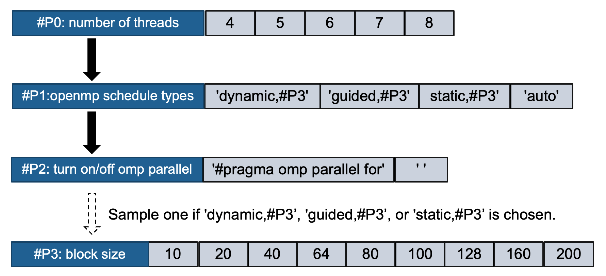

Tutorial: Autotune the hybrid MPI/OpenMP version of XSBench 
===================

This tutorial describes how to define autotuning problem and an evaluating method for autotuning ECP XSBench app. 

We assume that you have checked out a copy of `ytopt`. For guidelines on how to get ytopt set up, refer [Install instructions](https://github.com/ytopt-team/ytopt/blob/tutorial/README.md). 

You can install openmp for this example: `conda install -c conda-forge openmp`

Indentifying a problem to autotune 
-----------------------
In this tutorial, we target to autotune ECP XSBench app `<https://github.com/ANL-CESAR/XSBench>`.

XSBench is a mini-app representing a key computational kernel of the Monte Carlo neutron transport algorithm [(reference)](https://github.com/ANL-CESAR/XSBench). Save the related source and header files in the seprate folder: `mmp_cons.c`, `Main.c`, `Materials.c`, `XSutils.c`, `XSbench_header.h`, `make.bat`. For your convenience, we have the files in `<https://github.com/ytopt-team/ytopt/tree/tutorial/ytopt/benchmark/xsbench-mpi-omp/xsbench>`. 

In this exmaple, we introduce a constraint on parameters for openmp schedule types and block sizes. In the `mmp_cons.c`, we replace markers for the related paramters from the source file of the unconstrained problem `mmp.c` as follows (`mmp.c`⮕`mmp_cons.c`): 

`#pragma omp parallel for schedule(dynamic,#P1) reduction(+:verification)` ⮕ `#pragma omp parallel for schedule(#P1) reduction(+:verification)`
`#pragma omp parallel for schedule(dynamic, #P1)` ⮕ `#pragma omp parallel for schedule(#P1)`

Defining autotuning problem
-----------------------
We describe how to define your search problem `<https://github.com/ytopt-team/ytopt/blob/tutorial/ytopt/benchmark/xsbench-mpi-omp/xsbench/problem_cons.py>`

--------------
First, we first define search space using ConfigSpace that is a python library `<https://automl.github.io/ConfigSpace/master/>`.


```python
# import required library
import os, sys, time, json, math
import numpy as np
from autotune import TuningProblem
from autotune.space import *
import ConfigSpace as CS
import ConfigSpace.hyperparameters as CSH
from skopt.space import Real, Integer, Categorical

HERE = os.path.dirname(os.path.abspath(__file__))
sys.path.insert(1, os.path.dirname(HERE)+ '/plopper')
from plopper import Plopper
```

Our search space contains three parameters: 1) `p0`: number of threads, 2) `p1`: choice for openmp static/dynamic schedule types, 3) `p2`: turn on/off omp parallel, 4) `p3`: block size for openmp static/dynamic schedule.  


```python
# create an object of ConfigSpace
cs = CS.ConfigurationSpace(seed=1234)
# number of threads
p0= CSH.UniformIntegerHyperparameter(name='p0', lower=4, upper=8, default_value=8)
# choice for openmp static/dynamic schedule
p1 = CSH.CategoricalHyperparameter(name='p1', choices=['dynamic,#P3','guided,#P3','static,#P3','auto'], default_value='dynamic,#P3')
#omp parallel
p2= CSH.CategoricalHyperparameter(name='p2', choices=["#pragma omp parallel for", " "], default_value=' ')
#block size for openmp static/dynamic schedule
p3= CSH.OrdinalHyperparameter(name='p3', sequence=['10','20','40','64','80','100','128','160','200'], default_value='100')
cs.add_hyperparameters([p0, p1, p2, p3])
# problem space
input_space = cs
output_space = Space([Real(0.0, inf, name="time")])
```

Then, we define a constraint to decide block size for static and dynamic schedule. 

`p1` specifies omp scheduling types. If `auto` is chosen, we let the compiler and/or runtime system select a scheduling type. If `dynamic,#P3`, `guided,#P3`, or `static,#P3` is chosen, we need another parameter `p3` to specify a block-size for static/dynamic schedule. This can be visualized such as:



We can add the constraint such as follows:


```python
# add condition
cond1 = CS.InCondition(p3, p1, ['dynamic,#P3','static,#P3','guided,#P3'])
cs.add_conditions([cond1])

# problem space
input_space = cs
output_space = Space([Real(0.0, inf, name="time")])
```

--------------
Then, we need to define the objective function `myobj` to evaluate a point in the search space. 

In this example, we define an evaluating method (Plopper) for code generation and compilation. 
Plopper take source code and output directory and return an execution time. 


```python
dir_path = os.path.dirname(os.path.realpath(__file__))
kernel_idx = dir_path.rfind('/')
kernel = dir_path[kernel_idx+1:]
obj = Plopper(dir_path+'/mmp_cons.c',dir_path)

x1=['p0','p1','p2','p3']
def myobj(point: dict):
    def plopper_func(x):
        x = np.asarray_chkfinite(x)  # ValueError if any NaN or Inf
        value = [point[x1[0]],point[x1[1]],point[x1[2]],point[x1[3]]]
        print('CONFIG:',point)
        params = ["P0","P1","P2","P3"]
        result = obj.findRuntime(value, params)
        return result
    x = np.array([point[f'p{i}'] for i in range(len(point))])
    results = plopper_func(x)
    print('OUTPUT:%f',results)
    return results
```

The following describes our evaluating function, Plopper. You can find it `<https://github.com/ytopt-team/ytopt/blob/tutorial/ytopt/benchmark/xsbench-mpi-omp/plopper/plopper.py>`.  


```python
import os, sys, subprocess, random

class Plopper:
    def __init__(self,sourcefile,outputdir):
        self.sourcefile = sourcefile
        self.outputdir = outputdir+"/tmp_files"

        if not os.path.exists(self.outputdir):
            os.makedirs(self.outputdir)

    def createDict(self, x, params):
        dictVal = {}
        for p, v in zip(params, x):
            dictVal[p] = v
        return(dictVal)

    def plotValues(self, dictVal, inputfile, outputfile):
        with open(inputfile, "r") as f1:
            buf = f1.readlines()

        with open(outputfile, "w") as f2:
            for line in buf:
                modify_line = line
                for key, value in dictVal.items():
                    if key in modify_line:
                        if value != 'None': #For empty string options
                            modify_line = modify_line.replace('#'+key, str(value))

                if modify_line != line:
                    f2.write(modify_line)
                else:
                    f2.write(line)

    def findRuntime(self, x, params):
        interimfile = ""
        exetime = 1
        counter = random.randint(1, 10001) # To reduce collision increasing the sampling intervals
        interimfile = self.outputdir+"/"+str(counter)+".c"

        # Generate intermediate file
        dictVal = self.createDict(x, params)
        self.plotValues(dictVal, self.sourcefile, interimfile)

        #compile and find the execution time
        tmpbinary = interimfile[:-2]
        kernel_idx = self.sourcefile.rfind('/')
        kernel_dir = self.sourcefile[:kernel_idx]

        gcc_cmd = "mpicc -std=gnu99 -Wall -flto  -fopenmp -DOPENMP -DMPI -O3 "  + \
        " -o " + tmpbinary + " " + interimfile +" " + kernel_dir + "/Materials.c " \
        + kernel_dir + "/XSutils.c " + " -I" + kernel_dir + \
        " -lm" + " -L${CONDA_PREFIX}/lib"
        run_cmd = kernel_dir + "/exe.pl " +  tmpbinary

        compilation_status = subprocess.run(gcc_cmd, shell=True, stderr=subprocess.PIPE)

        #Find the execution time only when the compilation return code is zero, else return infinity
        if compilation_status.returncode == 0 :
            execution_status = subprocess.run(run_cmd, shell=True, stdout=subprocess.PIPE)
            exetime = float(execution_status.stdout.decode('utf-8'))
            if exetime == 0:
                exetime = 1
        else:
            print(compilation_status.stderr)
            print("compile failed")
        return exetime #return execution time as cost 
```

This file consists of several components.

`__init__()` takes paths of the source file and output directory, and creates the output directory if it does not exists.   


```python
def __init__(self,sourcefile,outputdir):
    # Initilizing global variables
    self.sourcefile = sourcefile
    self.outputdir = outputdir+"/tmp_files"

    if not os.path.exists(self.outputdir):
        os.makedirs(self.outputdir)
```

`createDict()` generates a dictionary for parameter labels and values.


```python
def createDict(self, x, params):
    dictVal = {}
    for p, v in zip(params, x):
        dictVal[p] = v
    return(dictVal)
```

`plotValues()` replaces the Markers in the source file with the corresponding prameter values of the parameter dictionary. 
For example, a sampled value for number of threads `p0` replaces `#P0` in line 349 `input.nthreads = #P0` of `mmp_cons.c` that is the original source file. 

If `dynamic,#P3` is chosen for `p1` along with `100` for `p3`, `#pragma omp parallel for schedule(#P1)` in `mmp_cons.c` is written as `#pragma omp parallel for schedule(dynamic,100)`. 

If `auto` is chosen for `p1`, `#pragma omp parallel for schedule(#P1)` in `mmp_cons.c` is written as `#pragma omp parallel for schedule(auto)`. Note that no value is chosen for `p3` by the constraint. 


```python
def plotValues(self, dictVal, inputfile, outputfile):
    with open(inputfile, "r") as f1:
        buf = f1.readlines()
    with open(outputfile, "w") as f2:
        for line in buf:
            modify_line = line
            for key, value in dictVal.items():
                if key in modify_line:
                    if value != 'None': #For empty string options
                        modify_line = modify_line.replace('#'+key, str(value))
            if modify_line != line:
                f2.write(modify_line)
            else:
                f2.write(line)  #To avoid writing the Marker
```

`findRuntime()` first calls `createDict()` to obatain configuration values and `plotValues()` to modify the original source code. 
After that, it generates the commandline `gcc_cmd` for compiling the modified source code and the commandline `run_cmd` for executing the compiled code. 
Then, it finds the compilation status using subprocess; finds the execution time of the compiled code; and returns the execution time as cost to the search module. 


```python
def findRuntime(self, x, params):
    interimfile = ""
    exetime = 1
    counter = random.randint(1, 10001) # To reduce collision increasing the sampling intervals          
    interimfile = self.outputdir+"/tmp_"+str(counter)+".c"

    # Generate intermediate file
    dictVal = self.createDict(x, params)
    self.plotValues(dictVal, self.sourcefile, interimfile)

    #compile and find the execution time
    tmpbinary = interimfile[:-2]
    kernel_idx = self.sourcefile.rfind('/')
    kernel_dir = self.sourcefile[:kernel_idx]

    gcc_cmd = "mpicc -std=gnu99 -Wall -flto  -fopenmp -DOPENMP -DMPI -O3 "  + \
    " -o " + tmpbinary + " " + interimfile +" " + kernel_dir + "/Materials.c " \
    + kernel_dir + "/XSutils.c " + " -I" + kernel_dir + \
    " -lm" + " -L${CONDA_PREFIX}/lib"
    run_cmd = kernel_dir + "/exe.pl " +  tmpbinary

    #Find the compilation status using subprocess
    compilation_status = subprocess.run(gcc_cmd, shell=True, stderr=subprocess.PIPE)

    #Find the execution time only when the compilation return code is zero, else return infinity
    if compilation_status.returncode == 0 :
        execution_status = subprocess.run(run_cmd, shell=True, stdout=subprocess.PIPE)
        exetime = float(execution_status.stdout.decode('utf-8'))
        if exetime == 0:
            exetime = 1
    else:
        print(compilation_status.stderr)
        print("compile failed")
    return exetime #return execution time as cost
```

Note: 
- `exe.pl` computes average the execution time over multiple runs. We execute once in this example to save time. 

--------------
Last, we create an object of the autotuning problem. The problem will be called in the commandline implementation. 


```python
Problem = TuningProblem(
    task_space=None,
    input_space=input_space,
    output_space=output_space,
    objective=myobj,
    constraints=None,
    model=None)
```

Running and viewing Results
-----------------------

Now, we can run the following command to autotune the program: 
--evaluator flag sets which object used to evaluate models, --problem flag sets path to the Problem instance you want to use for the search, --max-evals flag sets the maximum number of evaluations, --learner flag sets the type of learner (surrogate model).

- Go to where `problem_cons.py` such as

`
cd ytopt/benchmark/xsbench-mpi-omp/xsbench
`
- Start search

`python -m ytopt.search.ambs --evaluator ray --problem problem_cons.Problem --max-evals=10 --learner RF
`

Note that use `python3` if your environment is built with python3. 

--------------
Once autotuning kick off, ytopt.log, results.csv, and results.json will be rendered.

We can track the results of each run configuration from `ytopt.log` shows the following (output lines are truncated for readability here): 

```
2021-08-11 16:58:37|10215|INFO|ytopt.search.search:53] Created "ray" evaluator
2021-08-11 16:58:37|10215|INFO|ytopt.search.search:54] Evaluator: num_workers is 1
2021-08-11 16:58:37|10215|INFO|ytopt.search.hps.ambs:47] Initializing AMBS
2021-08-11 16:58:37|10215|INFO|ytopt.search.hps.optimizer.optimizer:51] Using skopt.Optimizer with RF base_estimator
2021-08-11 16:58:37|10215|INFO|ytopt.search.hps.ambs:79] Generating 1 initial points...
2021-08-11 16:58:38|10215|INFO|ytopt.evaluator.evaluate:104] Submitted new eval of {'p0': 4, 'p1': 'dynamic,#P3', 'p2': '#pragma omp parallel for', 'p3': '20'}
2021-08-11 16:59:19|10215|INFO|ytopt.evaluator.evaluate:206] New eval finished: {"p0": 4, "p1": "dynamic,#P3", "p2": "#pragma omp parallel for", "p3": "20"} --> 36.709
2021-08-11 16:59:19|10215|INFO|ytopt.evaluator.evaluate:217] Requested eval x: {'p0': 4, 'p1': 'dynamic,#P3', 'p2': '#pragma omp parallel for', 'p3': '20'} y: 36.709
2021-08-11 16:59:19|10215|INFO|ytopt.search.hps.ambs:92] Refitting model with batch of 1 evals
2021-08-11 16:59:19|10215|DEBUG|ytopt.search.hps.optimizer.optimizer:119] tell: {'p0': 4, 'p1': 'dynamic,#P3', 'p2': '#pragma omp parallel for', 'p3': '20'} --> (4, 'dynamic,#P3', '#pragma omp parallel for', '20'): evaluated objective: 36.709
2021-08-11 16:59:19|10215|INFO|ytopt.search.hps.ambs:94] Drawing 1 points with strategy cl_max
2021-08-11 16:59:20|10215|DEBUG|ytopt.search.hps.optimizer.optimizer:84] _ask: [7, 'static,#P3', ' ', '160'] lie: 36.709
2021-08-11 16:59:20|10215|INFO|ytopt.evaluator.evaluate:104] Submitted new eval of {'p0': 7, 'p1': 'static,#P3', 'p2': ' ', 'p3': '160'}
2021-08-11 16:59:47|10215|INFO|ytopt.evaluator.evaluate:206] New eval finished: {"p0": 7, "p1": "static,#P3", "p2": " ", "p3": "160"} --> 24.607
2021-08-11 16:59:47|10215|INFO|ytopt.evaluator.evaluate:217] Requested eval x: {'p0': 7, 'p1': 'static,#P3', 'p2': ' ', 'p3': '160'} y: 24.607
2021-08-11 16:59:47|10215|INFO|ytopt.search.hps.ambs:92] Refitting model with batch of 1 evals
2021-08-11 16:59:47|10215|DEBUG|ytopt.search.hps.optimizer.optimizer:119] tell: {'p0': 7, 'p1': 'static,#P3', 'p2': ' ', 'p3': '160'} --> (7, 'static,#P3', ' ', '160'): evaluated objective: 24.607
2021-08-11 16:59:47|10215|INFO|ytopt.search.hps.ambs:94] Drawing 1 points with strategy cl_max
2021-08-11 16:59:48|10215|DEBUG|ytopt.search.hps.optimizer.optimizer:84] _ask: [4, 'static,#P3', ' ', '40'] lie: 36.709
2021-08-11 16:59:48|10215|INFO|ytopt.evaluator.evaluate:104] Submitted new eval of {'p0': 4, 'p1': 'static,#P3', 'p2': ' ', 'p3': '40'}
2021-08-11 17:00:25|10215|INFO|ytopt.evaluator.evaluate:206] New eval finished: {"p0": 4, "p1": "static,#P3", "p2": " ", "p3": "40"} --> 34.472
2021-08-11 17:00:25|10215|INFO|ytopt.evaluator.evaluate:217] Requested eval x: {'p0': 4, 'p1': 'static,#P3', 'p2': ' ', 'p3': '40'} y: 34.472
2021-08-11 17:00:25|10215|INFO|ytopt.search.hps.ambs:92] Refitting model with batch of 1 evals
2021-08-11 17:00:25|10215|DEBUG|ytopt.search.hps.optimizer.optimizer:119] tell: {'p0': 4, 'p1': 'static,#P3', 'p2': ' ', 'p3': '40'} --> (4, 'static,#P3', ' ', '40'): evaluated objective: 34.472
2021-08-11 17:00:25|10215|INFO|ytopt.search.hps.ambs:94] Drawing 1 points with strategy cl_max
2021-08-11 17:00:26|10215|DEBUG|ytopt.search.hps.optimizer.optimizer:84] _ask: [5, 'static,#P3', '#pragma omp parallel for', '10'] lie: 36.709
2021-08-11 17:00:26|10215|INFO|ytopt.evaluator.evaluate:104] Submitted new eval of {'p0': 5, 'p1': 'static,#P3', 'p2': '#pragma omp parallel for', 'p3': '10'}
2021-08-11 17:00:59|10215|INFO|ytopt.evaluator.evaluate:206] New eval finished: {"p0": 5, "p1": "static,#P3", "p2": "#pragma omp parallel for", "p3": "10"} --> 31.29
2021-08-11 17:00:59|10215|INFO|ytopt.evaluator.evaluate:217] Requested eval x: {'p0': 5, 'p1': 'static,#P3', 'p2': '#pragma omp parallel for', 'p3': '10'} y: 31.29
2021-08-11 17:00:59|10215|INFO|ytopt.search.hps.ambs:92] Refitting model with batch of 1 evals
2021-08-11 17:00:59|10215|DEBUG|ytopt.search.hps.optimizer.optimizer:119] tell: {'p0': 5, 'p1': 'static,#P3', 'p2': '#pragma omp parallel for', 'p3': '10'} --> (5, 'static,#P3', '#pragma omp parallel for', '10'): evaluated objective: 31.29
2021-08-11 17:00:59|10215|INFO|ytopt.search.hps.ambs:94] Drawing 1 points with strategy cl_max
2021-08-11 17:00:59|10215|DEBUG|ytopt.search.hps.optimizer.optimizer:84] _ask: [6, 'guided,#P3', ' ', '200'] lie: 36.709
2021-08-11 17:00:59|10215|INFO|ytopt.evaluator.evaluate:104] Submitted new eval of {'p0': 6, 'p1': 'guided,#P3', 'p2': ' ', 'p3': '200'}
2021-08-11 17:01:31|10215|INFO|ytopt.evaluator.evaluate:206] New eval finished: {"p0": 6, "p1": "guided,#P3", "p2": " ", "p3": "200"} --> 28.761
2021-08-11 17:01:31|10215|INFO|ytopt.evaluator.evaluate:217] Requested eval x: {'p0': 6, 'p1': 'guided,#P3', 'p2': ' ', 'p3': '200'} y: 28.761
2021-08-11 17:01:31|10215|INFO|ytopt.search.hps.ambs:92] Refitting model with batch of 1 evals
2021-08-11 17:01:31|10215|DEBUG|ytopt.search.hps.optimizer.optimizer:119] tell: {'p0': 6, 'p1': 'guided,#P3', 'p2': ' ', 'p3': '200'} --> (6, 'guided,#P3', ' ', '200'): evaluated objective: 28.761
2021-08-11 17:01:31|10215|INFO|ytopt.search.hps.ambs:94] Drawing 1 points with strategy cl_max
2021-08-11 17:01:32|10215|DEBUG|ytopt.search.hps.optimizer.optimizer:84] _ask: [8, 'static,#P3', ' ', '100'] lie: 36.709
2021-08-11 17:01:32|10215|INFO|ytopt.evaluator.evaluate:104] Submitted new eval of {'p0': 8, 'p1': 'static,#P3', 'p2': ' ', 'p3': '100'}
2021-08-11 17:02:01|10215|INFO|ytopt.evaluator.evaluate:206] New eval finished: {"p0": 8, "p1": "static,#P3", "p2": " ", "p3": "100"} --> 26.74
2021-08-11 17:02:01|10215|INFO|ytopt.evaluator.evaluate:217] Requested eval x: {'p0': 8, 'p1': 'static,#P3', 'p2': ' ', 'p3': '100'} y: 26.74
2021-08-11 17:02:01|10215|INFO|ytopt.search.hps.ambs:92] Refitting model with batch of 1 evals
2021-08-11 17:02:01|10215|DEBUG|ytopt.search.hps.optimizer.optimizer:119] tell: {'p0': 8, 'p1': 'static,#P3', 'p2': ' ', 'p3': '100'} --> (8, 'static,#P3', ' ', '100'): evaluated objective: 26.74
2021-08-11 17:02:01|10215|INFO|ytopt.search.hps.ambs:94] Drawing 1 points with strategy cl_max
2021-08-11 17:02:02|10215|DEBUG|ytopt.search.hps.optimizer.optimizer:84] _ask: [7, 'guided,#P3', ' ', '128'] lie: 36.709
2021-08-11 17:02:02|10215|INFO|ytopt.evaluator.evaluate:104] Submitted new eval of {'p0': 7, 'p1': 'guided,#P3', 'p2': ' ', 'p3': '128'}
2021-08-11 17:02:33|10215|INFO|ytopt.evaluator.evaluate:206] New eval finished: {"p0": 7, "p1": "guided,#P3", "p2": " ", "p3": "128"} --> 28.408
2021-08-11 17:02:33|10215|INFO|ytopt.evaluator.evaluate:217] Requested eval x: {'p0': 7, 'p1': 'guided,#P3', 'p2': ' ', 'p3': '128'} y: 28.408
2021-08-11 17:02:33|10215|INFO|ytopt.search.hps.ambs:92] Refitting model with batch of 1 evals
2021-08-11 17:02:33|10215|DEBUG|ytopt.search.hps.optimizer.optimizer:119] tell: {'p0': 7, 'p1': 'guided,#P3', 'p2': ' ', 'p3': '128'} --> (7, 'guided,#P3', ' ', '128'): evaluated objective: 28.408
2021-08-11 17:02:33|10215|INFO|ytopt.search.hps.ambs:94] Drawing 1 points with strategy cl_max
2021-08-11 17:02:34|10215|DEBUG|ytopt.search.hps.optimizer.optimizer:84] _ask: [8, 'static,#P3', '#pragma omp parallel for', '200'] lie: 36.709
2021-08-11 17:02:34|10215|INFO|ytopt.evaluator.evaluate:104] Submitted new eval of {'p0': 8, 'p1': 'static,#P3', 'p2': '#pragma omp parallel for', 'p3': '200'}
2021-08-11 17:03:01|10215|INFO|ytopt.evaluator.evaluate:206] New eval finished: {"p0": 8, "p1": "static,#P3", "p2": "#pragma omp parallel for", "p3": "200"} --> 26.002
2021-08-11 17:03:01|10215|INFO|ytopt.evaluator.evaluate:217] Requested eval x: {'p0': 8, 'p1': 'static,#P3', 'p2': '#pragma omp parallel for', 'p3': '200'} y: 26.002
2021-08-11 17:03:01|10215|INFO|ytopt.search.hps.ambs:92] Refitting model with batch of 1 evals
2021-08-11 17:03:01|10215|DEBUG|ytopt.search.hps.optimizer.optimizer:119] tell: {'p0': 8, 'p1': 'static,#P3', 'p2': '#pragma omp parallel for', 'p3': '200'} --> (8, 'static,#P3', '#pragma omp parallel for', '200'): evaluated objective: 26.002
2021-08-11 17:03:02|10215|INFO|ytopt.search.hps.ambs:94] Drawing 1 points with strategy cl_max
2021-08-11 17:03:02|10215|DEBUG|ytopt.search.hps.optimizer.optimizer:84] _ask: [8, 'dynamic,#P3', ' ', '40'] lie: 36.709
2021-08-11 17:03:02|10215|INFO|ytopt.evaluator.evaluate:104] Submitted new eval of {'p0': 8, 'p1': 'dynamic,#P3', 'p2': ' ', 'p3': '40'}
2021-08-11 17:03:31|10215|INFO|ytopt.evaluator.evaluate:206] New eval finished: {"p0": 8, "p1": "dynamic,#P3", "p2": " ", "p3": "40"} --> 26.108
2021-08-11 17:03:31|10215|INFO|ytopt.evaluator.evaluate:217] Requested eval x: {'p0': 8, 'p1': 'dynamic,#P3', 'p2': ' ', 'p3': '40'} y: 26.108
2021-08-11 17:03:31|10215|INFO|ytopt.search.hps.ambs:92] Refitting model with batch of 1 evals
2021-08-11 17:03:31|10215|DEBUG|ytopt.search.hps.optimizer.optimizer:119] tell: {'p0': 8, 'p1': 'dynamic,#P3', 'p2': ' ', 'p3': '40'} --> (8, 'dynamic,#P3', ' ', '40'): evaluated objective: 26.108
2021-08-11 17:03:31|10215|INFO|ytopt.search.hps.ambs:94] Drawing 1 points with strategy cl_max
2021-08-11 17:03:31|10215|DEBUG|ytopt.search.hps.optimizer.optimizer:86] Duplicate _ask: [7, 'static,#P3', ' ', '160'] lie: 36.709
2021-08-11 17:03:31|10215|INFO|ytopt.evaluator.evaluate:101] UID: {"p0": 7, "p1": "static,#P3", "p2": " ", "p3": "160"} already evaluated; skipping execution
2021-08-11 17:03:33|10215|INFO|ytopt.evaluator.evaluate:217] Requested eval x: {'p0': 7, 'p1': 'static,#P3', 'p2': ' ', 'p3': '160'} y: 24.607
2021-08-11 17:03:33|10215|INFO|ytopt.search.hps.ambs:101] Hyperopt driver finishing
```

Look up the best configuration (found so far) and its value by inspecting the following created file: `results.csv` and `results.json`. 

In this run, the best configuration and its runtime is obtained:

`{'p0': 7, 'p1': 'static,#P3', 'p2': ' ', 'p3': '160'}: 24.607`
